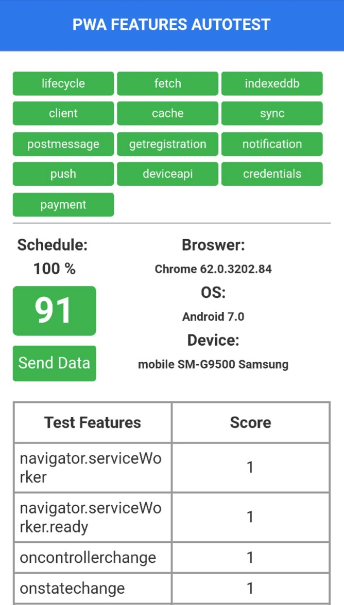

# PWA Features Autotest


Tracks the features of service worker supported in browsers and analyse the PWA supported in browsers.

> [PWA Trend](https://lavas.baidu.com/ready): You can get the statistics which is updated per two weeks.

> [PWA Features Autotest](https://lavas-project/lavas-project.github.io/pwa-demo/pwa-features-autotest/sequence): Provide auto test page for developer.

> [Maintain Data Manually](https://github.com/lavas-project/pwa-expo): Manifest feature and some extra details.


## Run

To install and run:

```sh
npm install

npm run dev
```

To build the site:

```sh
npm run build

```

## Contribute

Found the test result is out of date ?

If convenient, please offer more information on the issue, such as the capture pic.

And we will verify and update the data promptly.




## Reference:

> Jake's [isserviceworkerready](https://github.com/jakearchibald/isserviceworkerready).  Mainly focus on foreign browser and environment.

> Johann's [is-pwa-ready](https://github.com/toxic-johann/is-pwa-ready).  Mainly focus on Chinese browser and environment.


